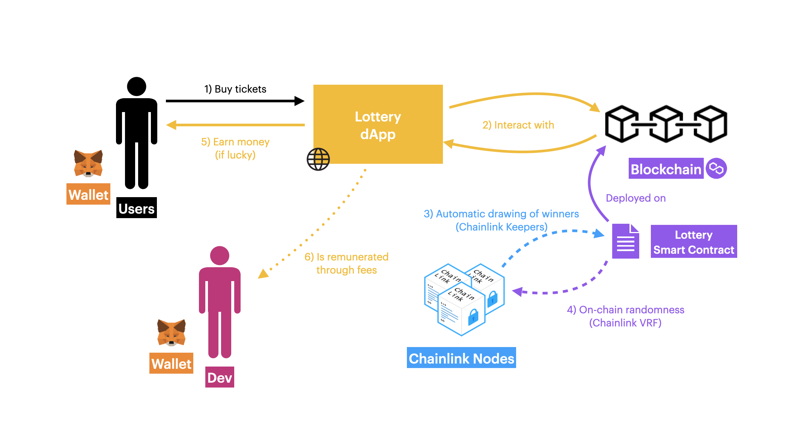

# 🎲 Web3 Lottery
> **This project aims to develop a lottery game leveraging blockchain technology and oracles to ensure transparency and reliability**.

The Web3 Lottery project was developed over a relatively short time period as part of the [Polygon BUILD IT: Summer 2022 
](https://devpost.com/software/avocado-i92guw?ref_content=my-projects-tab&ref_feature=my_projects) hackathon. The main objective was to develop a web3 product from scratch and complete it so that it was ready for deployment on the mainnet. Of course, not everything is perfect and there are undoubtedly things to improve, but most of the heavy work has been done. On top of that, this project allows me to demonstrate my ability to lead a blockchain project, be it on smart contract, testing and security aspects or rather on the front-end and automation parts (ci/cd pipelines).

## The Rules
- 100 tickets are available per round, each at 0.01 MATIC.
- At the end of the round, the contract randomly picks a number using the Chainlink oracle. The lucky owner of the winning ticket wins the jackpot!
- A round lasts exactly 24 hours.
- In order to finance maintenance and operational costs, the winner takes 90% of the jackpot, the team behind the project gets 7% and the contract keeps 3%.

## System Diagram
Because a diagram explains ideas way better than three paragraphs, here it is.\

	

## Technologies used
- Front-end: Next.js, Typescript, HTML, CSS.
- Back-end: Solidity, Typescript, Hardhat, Foundry, Chainlink VRF and Keepers.
- Automation: Github CI/CD pipelines.
